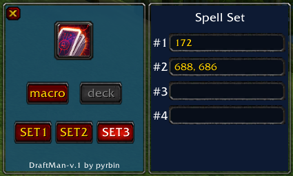

# DraftMan - WoW Ascension S4 Draft Mode Reroller
__DISCLAIMER: this addon was very roughly and quickly put together over a night so there might be bugs!__

* Auto-roller for Project Ascension Season 4 Draft Mode 
* Designed with a key spammer in mind
* Simple GUI for selecting spells/sets

## Guide
* Click the "create macro" button and put the macro on the Action Bar (Action Bar 1)
* Open a set (click button "SET1" etc..) and fill the fields with the Spell ids you want (list below)
* If you want to target more than one spell in a field you can seperate them by commas eg. "172, 688"
* Start spamming the Macro (or use your prefered key spammer)
* When a set is found the addon will delete the macro and logout

### An example of a set:

In this case the addon will keep rolling till Corruption (172) + either Summon Imp (688) or Shadow Bolt (686) is aquired

## What set is chosen?

At the moment the selection of what set to roll for is very simple; the lowered number set will always have priority.
If Set1 and Set2 shares the same spell and it shows up on Roll1 the rest of the Cards for that roll will be checked against
Set1's required spells. It is therefore recommended to not have that many overlapping spells between sets (if any).

##  Spell ids
NOTE: list taken from [another reroll addon](https://github.com/Malow/MaloWAscensionReroller#statistics-from-randomly-picking-spells)(much more advanced and feature rich than this one)
- Corruption - 172
- Charge - 100
- Seal of Righteousness - 21084
- Healing Wave - 331
- Bloodrage - 2687
- Searing Totem - 3599
- Mark of the Wild - 1126
- Overpower - 7384
- Righteous Fury - 25780
- Raptor Strike - 2973
- Sinister Strike - 1752
- Lightning Shield - 324
- Power Word: Fortitude - 1243
- Concussive Shot - 5116
- Swipe (Bear) - 779
- Fireball - 133F
- Arcane Intellect - 1459
- Backstab - 53
- Blessing of Wisdom - 19742
- Defensive Stance - 71
- Thunder Clap - 6343
- Curse of Weakness - 702
- Devotion Aura - 465
- Life Tap - 1454
- Wrath - 5176
- Rejuvenation - 774
- Thorns - 467
- Summon Imp - 688
- Aspect of the Hawk - 13165
- Stoneskin Totem - 8071
- Fade - 586
- Demoralizing Roar - 99
- Demon Skin - 687
- Shield Bash - 72
- Maul - 6807
- Evasion - 5277
- Divine Protection - 498
- Smite - 585
- Heroic Strike - 78
- Victory Rush - 34428
- Healing Touch - 5185
- Earth Shock - 8042
- Sprint - 2983
- Shield Block - 2565
- Stoneclaw Totem - 5730
- Renew - 139
- Auto Shot - 965202
- Frostbolt - 116
- Battle Shout - 6673
- Arcane Shot - 3044
- Growl - 6795
- Shadow Word: Pain - 589
- Immolate - 348
- Serpent Sting - 1978
- Hunter's Mark - 1130
- Battle Stance - 2457
- Rend - 772
- Lightning Bolt - 403
- Hamstring - 1715
- Pick Pocket - 921
- Frost Armor - 168
- Blessing of Might - 19740
- Gouge - 1776
- Arcane Missiles - 5143
- Moonfire - 8921
- Shadow Bolt - 686
- Holy Light - 635
- Tame Beast - 965200
- Aspect of the Monkey - 13163
- Stealth - 1784
- Fire Blast - 2136
- Bear Form - 5487
- Mongoose Bite - 1495
- Curse of Agony - 980
- Eviscerate - 2098
- Taunt - 355
- Judgement of Light - 20271
- Judgement of Wisdom - 20354